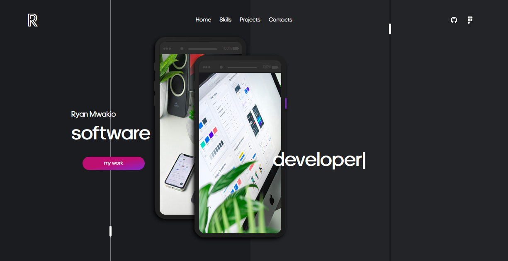

# PORTFOLIO Ryan Mwakio


figma design can be found here [portfolio figma design](<https://www.figma.com/file/DJzQZPPSm3Wm4P9FgTPoAB/portfolio-(Community)?node-id=0%3A1>)

## Description:

portfolio site developer and designed by [Ryan Mwakio](https://ryanmwakio.netlify.app/). Motivation behind creating this site was to develop a portfolio that I enjoy looking at. The templates out there weren't giving that so I decided to create this and make it available for everyone. The project is running on purely react with various extra small libraries for functionalities.

## How to install and run the project

```bash
git clone https://github.com/ryanmwakio/portfolio.git
```

install all node dependecies

```bash
npm install
```

run project

```bash
npm start
```

## How to use the project

use navigations completely configured with smooth scroll or you can just scroll.

# Terms of use

I'm cool with anyone using the code or parts of the code for their own site, it is open source so people can learn from it and adapt it. However, I would encourage you to modify the theme and components it to make it your own. If you are using the site's design largely unmodified, I'd appreciate being credited as the designer of the website.

I do not give permission to present any of my projects as your own (this is being actively used as my portfolio site and these are my real projects I've worked on).
